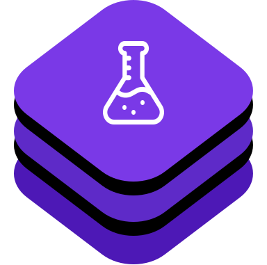

# D360TesterKit

The `D360TesterKit` is a small framework that can simulate the 360dialog campaings for integration testing. 

![badge-languages] ![badge-pms]




⚠️ **Please note that this framework is not inteded for production use and its sole purpose is to facilitate the 360dialog SDK integration.**

In fact, if this framework is included in an app built for production, it will crash the app to assert that the framework is not shipped by mistake in production.

For more detailed documentation, please refer to our [Developer Portal](http://developer.360dialog.io)

# Installation

Only [Carthage](https://github.com/Carthage/Carthage) is supported.

- Cartfile

	```bash
	# Cartfile
	github "360dialog/sdk-tester-ios"
	```

- Run  `bash carthage update --use-ssh`
- Add the `D360TesterKit.framework` to your app

# Usage

## Inbox Messages

Related [Integration guides can be found here](https://developer.360dialog.io/mobile/apple/inbox_service.html)

**Simple InboxMessage**

The default sample InboxMessage has a InApp as associated action. The InboxMessage will be delivered to the Inbox and when tapped, an InApp will be presented

```swift
DTTester.send(DTInbox(title: "Hi 👋", body: "Tap to open an InApp"))
```

**InboxMessage with a OpenURL action**

You can add other associated actions such as open URL

```swift
let campaign = DTInbox(title: "Hi 👋", body: "Tap to open a URL")
        
// You can customise the image url of the inbox attachment
campaign.attachmentURL = URL(string: "https://inapp-samples.s3.amazonaws.com/images/push-round@3x.png")!
	
// The inbox will have a URL as action when tapped
campaign.action = DTURLAction(url: URL(string:"https://www.360dialog.com/")!)

DTTester.send(campaign)
```

**InboxMessage with a DeepLink**

```swift
let campaign = DTInbox(title: "Hi 👋", body: "Tap to open a deep link")
        
// The inbox will have a deep link as an action. You can use your app's deeplink here as well
campaign.action =  DTURLAction(url: URL(string:"sms://")!)

DTTester.send(campaign)
```


## InApp Messages

Related [Integration guides can be found here](https://developer.360dialog.io/mobile/apple/in_app_messaging.html)

**Simple InApp**

You can send a sample InApp message without any customisation as follows. This allows you to test the behaviour of your app when it's received

```swift
DTTester.send(DTInApp())
```

**Custom InApp**

If you have your hosted InApp html, you can supply the URL 

```swift
// This inapp is a default 360dialog inapp and you can send it as it is.
let campaign = DTInApp()
	
// optionally, you can supply your own HTML to the InApp
// campaign.url = URL(string: "https://inapp-samples.s3.amazonaws.com/push-permissions.html")!
	
DTTester.send(DTInApp(url: URL(string: "https://inapp-samples.s3.amazonaws.com/push-permissions.html")!))

```

## Native Notifications

Related [Integration guides can be found here](https://developer.360dialog.io/mobile/apple/push_notification.html)


**Simple Notification**

```swift
DTTester.send(DTNotification(title: "Hi 👋", body: "Tap to open a URL"))
```

**Foreground Notification**

```swift
let campaign = DTNotification(title: "Hi 👋", body: "Tap to open a URL")

// Set the URL of the rich content
// The rich content is simulated as well 
campaign.richURL = URL(string: "https://inapp-samples.s3.amazonaws.com/examples/JPG/desertsmall.jpg")!
    	    
// By default, the notification is a foreground notification. You can disable it here
campaign.isForeground = false

    
DTTester.send(campaign)
```

**Rich Notification**

```swift
let campaign = DTNotification(title: "Hi 👋", body: "Tap to open a URL")

// Set the URL of the rich content
campaign.richURL = URL(string: "https://inapp-samples.s3.amazonaws.com/examples/JPG/desertsmall.jpg")!
    	    
// By default, the notification is a foreground notification. You can disable it here
campaign.isForeground = false

    
DTTester.send(campaign)
```
	
Note the the rich content is sumulated here by a local notification. For a proper rich push notification integration, be sure to follow the [integration guides.](https://developer.360dialog.io/mobile/apple/push_notification.html#rich-notifications-setup)
	
[badge-languages]: https://img.shields.io/badge/languages-Swift%20%7C%20ObjC-orange.svg
[badge-pms]: https://img.shields.io/badge/supports-Carthage-green.svg


